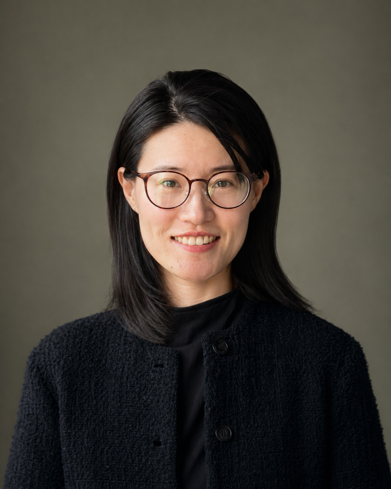

::: {.intro-grid}
::: {.profile}

### Xiaoxi Pan, Ph.D.

Pan Lab  
Huntsman Cancer Institute  
University of Utah

[Personal website](https://xi11.github.io/) · [Google Scholar](https://scholar.google.com/citations?user=HlK3iTkAAAAJ)
:::

::: {.introduction}
# Pan Lab

Computational Pathology · Artificial Intelligence · Spatial Omics

## About

We study how the organization of cells within tissue shapes cancer biology. Our research brings together computational pathology, interpretable AI, and spatial omics to connect microscopic tissue patterns with biological mechanisms and clinically meaningful questions.

Led by Xiaoxi Pan, the lab builds on his work in medical image analysis and cancer research at the Institute of Cancer Research and MD Anderson Cancer Center. He received his Ph.D. in Optics, Photonics and Image Processing at École Centrale Marseille.

[Explore our research](research.qmd) · [Join the lab](join.qmd)

## News

- **April 2026** — Xiaoxi gave an invited talk at the Oncological Data Science Symposium at Huntsman Cancer Institute.
- **April 2026** — Xiaoxi gave an invited talk at the BCB Seminar Series.
- **December 2025** — A co-authored paper was accepted by *Cell Reports Medicine*.

::: {.content-note}
More lab news will be added here as the team grows.
:::
:::
:::
