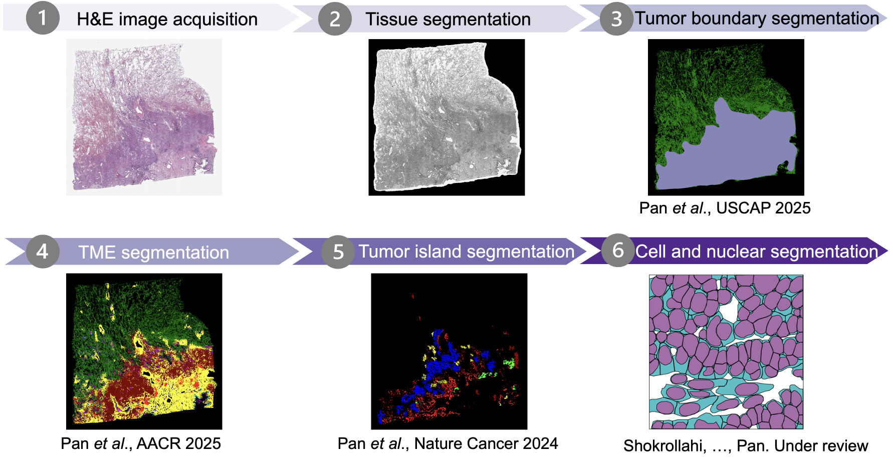
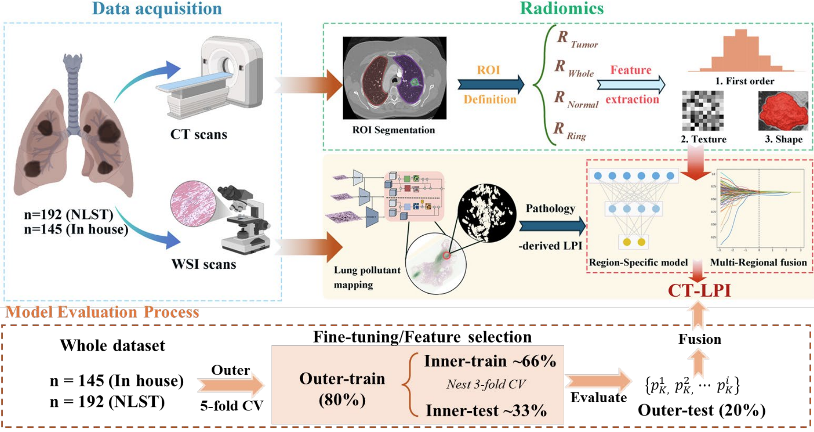
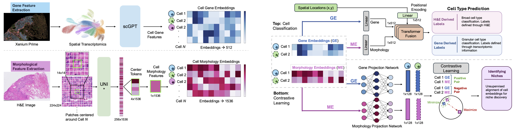

We connect tissue structure, cellular neighborhoods, and molecular measurements to understand cancer, primarily focusing on three themes: (1) AI model development for large-scale pathology image analysis, (2) Multi-modal integration, including radiology, pathology and omics data, and (3) pollutant’s effect on tumor microenvironment in lung cancer for never-smokers.

## AI model development for large-scale pathology image analysis

How can routine tissue images reveal meaningful differences in cancer? We develop interpretable image analysis methods to characterize cells, tissue architecture, and tumor heterogeneity, with an emphasis on biological understanding and clinical relevance.

## Multi-modal integration, including radiology, pathology and omics data

Cancer develops within a complex community of tumor, immune, and stromal cells. We investigate how their arrangement and interactions relate to disease progression and treatment response.

## Pollutant’s effect on tumor microenvironment in lung cancer for never-smokers

