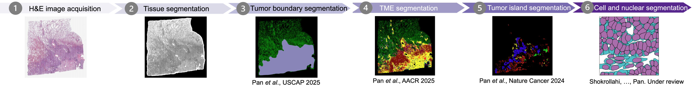
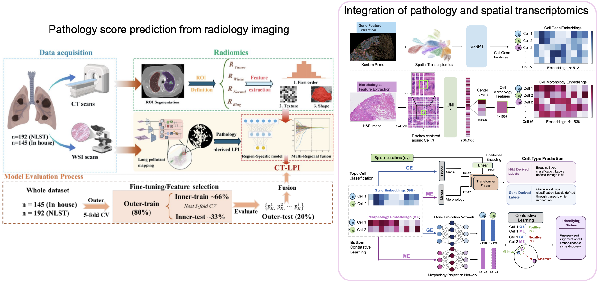
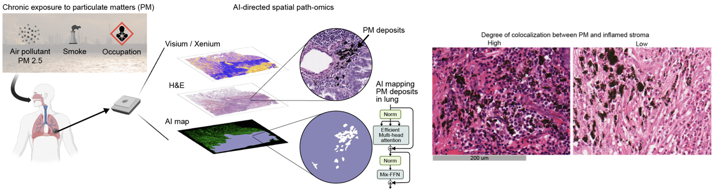

We connect tissue structure, cellular neighborhoods, and molecular measurements to understand cancer. Our research focuses on three complementary themes: **(1) AI model development for large-scale pathology image analysis, (2) multimodal integration of radiology, pathology, and omics data, and (3) the effects of inhaled pollutants on the tumor microenvironment and treatment response in lung cancer, particularly in never-smokers.**

## AI model development for large-scale pathology image analysis

We develop computational pathology models for tissue segmentation, histologic pattern classification, and cell-level phenotyping, and apply them to large clinical cohorts. These models quantify tumor architecture, cellular composition, morphology, spatial organization, and microenvironmental heterogeneity, enabling studies of survival in lung cancer, treatment response in triple-negative breast cancer, and cancer progression in Barrett’s esophagus.

## Multimodal integration across imaging and molecular data

We integrate pathology with radiology, spatial transcriptomics, and other molecular data to connect imaging phenotypes with cellular and molecular states across spatial scales. By jointly modeling tissue morphology, radiologic features, gene expression, and spatial context, we aim to define clinically relevant tumor phenotypes and improve biomarker discovery, patient stratification, and outcome prediction.

## Pollutant-associated tumor microenvironments in lung cancer

We study how inhaled pollutants, including tissue-resident particulate matter (PM), reshape the tumor microenvironment in lung cancer, with a particular focus on never-smokers. By combining AI-based pollutant mapping with spatial transcriptomics and cellular-resolution analysis, we investigate pollutant-associated immune and stromal states, their relationship to tumor progression, and whether these microenvironmental changes influence response to systemic therapy.

