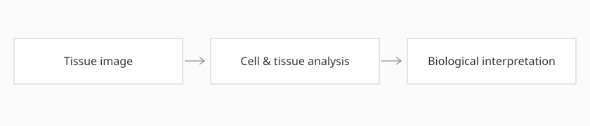
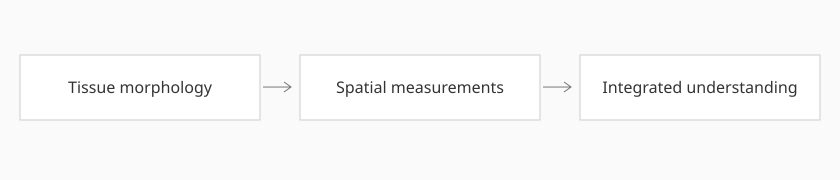

We connect tissue structure, cellular neighborhoods, and molecular measurements to understand cancer. The themes below describe our research interests; individual projects and study figures will be added as they become available.

## Computational pathology

How can routine tissue images reveal meaningful differences in cancer? We develop interpretable image analysis methods to characterize cells, tissue architecture, and tumor heterogeneity, with an emphasis on biological understanding and clinical relevance.

## Spatial organization of the tumor microenvironment

Cancer develops within a complex community of tumor, immune, and stromal cells. We investigate how their arrangement and interactions relate to disease progression and treatment response.

## Integrating pathology and spatial omics

We bring tissue images together with spatial molecular measurements to study how cellular states map onto tissue structure. These complementary views can help explain microenvironmental changes and generate hypotheses for further investigation.

All figures are conceptual illustrations, not experimental results.
